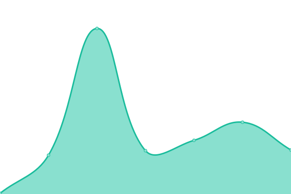
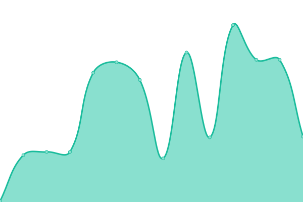

> **Hu:** Landing, Thread y Central. Configuración en [SETUP.md](./SETUP.md) (GH_PAT, Slack, Pages, DNS).

**PWA (instalar en el celu):** Upptime no personaliza el Web Manifest desde `.upptimerc.yml`. Este repo sobrescribe con [`assets/manifest.json`](./assets/manifest.json) + `logo-192.png` / `logo-512.png` (mismo estilo que Thread). Tras cambiar marca, regenerá los PNGs (p. ej. desde `icon-512` de Thread: `curl -sL https://thread.gethu.ai/icon-512.png -o assets/logo-512.png` y `sips -z 192 192 assets/logo-512.png --out assets/logo-192.png` en macOS).

# 

This repository contains the open-source uptime monitor and status page for [hu](https://gethu.ai/), powered by [Upptime](https://github.com/upptime/upptime).

With [Upptime](https://upptime.js.org), you can get your own unlimited and free uptime monitor and status page, powered entirely by a GitHub repository. We use [Issues](https://github.com/gethu-ai/status-page/issues) as incident reports, [Actions](https://github.com/gethu-ai/status-page/actions) as uptime monitors, and [Pages](https://status.gethu.ai) for the status page.

<!--start: status pages-->
<!-- This summary is generated by Upptime (https://github.com/upptime/upptime) -->
<!-- Do not edit this manually, your changes will be overwritten -->
<!-- prettier-ignore -->
| URL | Status | History | Response Time | Uptime |
| --- | ------ | ------- | ------------- | ------ |
|  [Hu](https://gethu.ai) | Operativo | [hu.yml](https://github.com/gethu-ai/status-page/commits/HEAD/history/hu.yml) | 

 799ms
     
 | 

<a href="https://status.gethu.ai/history/hu">100.00%</a>
    

|  [Hu Thread](https://thread.gethu.ai) | Operativo | [hu-thread.yml](https://github.com/gethu-ai/status-page/commits/HEAD/history/hu-thread.yml) | 

 1124ms
     
 | 

<a href="https://status.gethu.ai/history/hu-thread">100.00%</a>
    

|  [Hu Central](https://central.gethu.ai) | Operativo | [hu-central.yml](https://github.com/gethu-ai/status-page/commits/HEAD/history/hu-central.yml) | 

 1307ms
     
 | 

<a href="https://status.gethu.ai/history/hu-central">100.00%</a>
    

|  [Hu Agents](https://agents.gethu.ai) | Operativo | [hu-agents.yml](https://github.com/gethu-ai/status-page/commits/HEAD/history/hu-agents.yml) | 

 570ms
     
 | 

<a href="https://status.gethu.ai/history/hu-agents">100.00%</a>
    

|  [Hu Flows](https://flows.gethu.ai) | Operativo | [hu-flows.yml](https://github.com/gethu-ai/status-page/commits/HEAD/history/hu-flows.yml) | 

 960ms
     
 | 

<a href="https://status.gethu.ai/history/hu-flows">100.00%</a>
    

<!--end: status pages-->

[**Visit our status website →**](https://status.gethu.ai)

## 📄 License

- Powered by: [Upptime](https://github.com/upptime/upptime)
- Code: [MIT](./LICENSE) © [Anand Chowdhary](https://anandchowdhary.com), supported by [Pabio](https://pabio.com)
- Data in the `./history` directory: [Open Database License](https://opendatacommons.org/licenses/odbl/1-0/)
